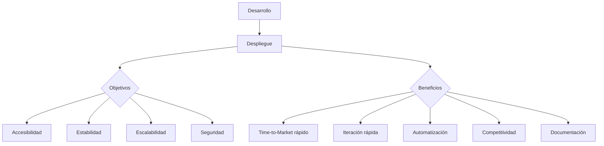
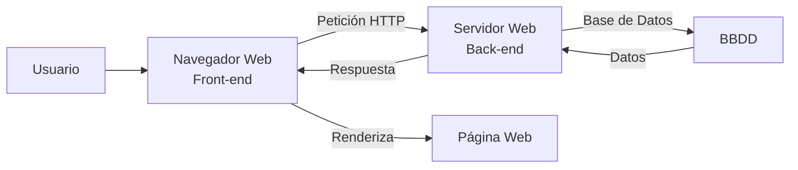

- [1. Introducción al Desarrollo Web en Entorno Servidor](#1-introducción-al-desarrollo-web-en-entorno-servidor)
    - [1.1. El Desarrollo Web Actual](#11-el-desarrollo-web-actual)
    - [1.2. Modelos de Ejecución de Código en el Servidor y en el Cliente](#12-modelos-de-ejecución-de-código-en-el-servidor-y-en-el-cliente)

# 1. Introducción al Desarrollo Web en Entorno Servidor

## 1.1. El Desarrollo Web Actual

¿Algunas vez has pensado lo que pasa una vez le das al botón de "Enviar" en un formulario web? ¿O cómo es posible que puedas ver tu perfil en una red social, comprar en una tienda online o ver una película en streaming desde cualquier dispositivo? ¿O que pasa cuando pones una URL en el navegador? Detrás de estas acciones aparentemente simples, hay un complejo ecosistema de tecnologías y procesos que hacen posible la experiencia web moderna.

El desarrollo web moderno es un campo en constante evolución que abarca la creación y mantenimiento de sitios web y aplicaciones que operan a través de Internet. En la actualidad, el desarrollo no solo se enfoca en la funcionalidad, sino también en cómo estas aplicaciones se pondrán a disposición de los usuarios, un proceso crucial conocido como **despliegue**. Este proceso es fundamental para la viabilidad de cualquier proyecto web, ya que permite que la aplicación pase del entorno de desarrollo a un entorno de producción, donde será accesible para los usuarios finales.

Los principales objetivos del despliegue son garantizar la **accesibilidad**, la **estabilidad**, la **escalabilidad** y la **seguridad** de las aplicaciones. Un despliegue eficiente contribuye a una **rapidez en el *Time-to-Market***, lo que permite a las empresas lanzar productos más rápidamente. Facilita la **iteración rápida** y la entrega continua de nuevas funcionalidades y mejoras, esencial para adaptarse a las necesidades del mercado y de los usuarios. La **automatización** de los procesos de despliegue reduce los errores humanos y aumenta la eficiencia, liberando a los equipos de desarrollo para tareas más estratégicas. Un despliegue eficaz mejora la **competitividad** de una empresa al proporcionar un servicio fiable y de alta calidad. Además, la **documentación** de todos los procesos de despliegue es indispensable para asegurar que puedan ser replicados, para la resolución de problemas y para la formación de nuevos miembros del equipo.

📝 **Nota del Profesor**: El despliegue no es solo "subir" la aplicación a un servidor. Es un proceso estratégico que incluye configuración, pruebas, monitorización y documentación. Un buen despliegue puede marcar la diferencia entre el éxito y el fracaso de una aplicación.

💡 **Tip del Examinador**: Para el examen, recuerda que el **despliegue** es el puente entre el desarrollo y la producción. Conoce bien sus objetivos: accesibilidad, estabilidad, escalabilidad y seguridad.

⚠️ **Advertencia**: Nunca despliegues a producción sin pasar por entornos de prueba (staging, testing). Los errores en producción pueden ser costosos.

### 🧠 Analogía: La Mudanza

Imagina que el **desarrollo** es como construir muebles a medida en tu taller. El **despliegue** es el proceso de empaquetar esos muebles, transportarlos a la nueva casa, montarlos y dejarlos listos para que la familia los use. De nada sirve un mueble precioso si se rompe en el camión o si no cabe por la puerta.

## 1.2. Modelos de Ejecución de Código en el Servidor y en el Cliente

La lógica de una aplicación web se divide y ejecuta en dos entornos principales, cada uno con responsabilidades específicas: el lado del cliente y el lado del servidor.

El **código que se ejecuta en el lado del cliente** (Front-end) opera en el navegador web del usuario. Se desarrolla principalmente con HTML y CSS para la estructura y el estilo, y JavaScript para la interactividad y la lógica dinámica que ocurre en el navegador. Este código permite animaciones, validaciones de formularios y la modificación del contenido de la página sin recargarla completamente, gracias a técnicas como AJAX.

Por otro lado, el **código que se ejecuta en el lado del servidor** (Back-end) corre en un servidor web o de aplicaciones. Es responsable de la lógica de negocio, la interacción con bases de datos y la generación del contenido dinámico que luego se envía al navegador del cliente.

Ambos modelos trabajan en conjunto: el servidor puede generar una página con contenido inicial, y el cliente puede ejecutar JavaScript para añadir interactividad, realizar validaciones preliminares en formularios o cargar datos adicionales de forma asíncrona. Por ejemplo, en una aplicación de correo web, el programa que obtiene los mensajes de una base de datos se ejecuta en el servidor, mientras que el navegador ejecuta el código que avisa si se olvida el asunto de un mensaje. Para verificar la longitud mínima de una contraseña, sería preferible que el código de comprobación se ejecutara en el navegador web, ya que no es necesario enviar la contraseña al servidor para esta tarea.

📝 **Nota del Profesor**: La división entre Front-end y Back-end es fundamental. El Front-end se ejecuta en el navegador del cliente, el Back-end en el servidor. JavaScript es el puente entre ambos.

💡 **Tip del Examinador**: Distingue claramente:
- **Front-end**: HTML, CSS, JavaScript → Se ejecuta en el navegador
- **Back-end**: PHP, Java, Python, Node.js → Se ejecuta en el servidor

⚠️ **Advertencia**: Las validaciones en el cliente son para mejorar la experiencia de usuario (UX), NO para seguridad. Siempre valida también en el servidor.

### 🍽️ Analogía: El Restaurante

*   **Cliente (Tú)**: Eres el usuario. Miras el menú (Interfaz/Front-end) y pides un plato.
*   **Camarero (Navegador/Red)**: Toma tu nota y la lleva a la cocina. No cocina, solo transporta mensajes.
*   **Cocina (Servidor/Back-end)**: Recibe la orden. El chef comprueba si hay ingredientes en la despensa (Base de Datos), cocina el plato y lo entrega al camarero.
*   **Plato (Web)**: Lo que recibes listo para consumir. No ves cómo se cocinó, solo ves el resultado.