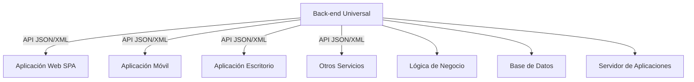
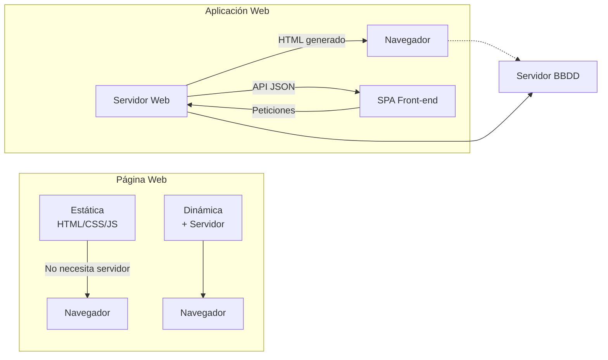

- [2. Componentes de una Web: Front-end, Back-end, Página Web vs. Aplicación Web](#2-componentes-de-una-web-front-end-back-end-página-web-vs-aplicación-web)
    - [2.1. Front-end y Back-end: La División y la Universalidad del Back-end](#21-front-end-y-back-end-la-división-y-la-universalidad-del-back-end)
    - [2.2. Página Web vs. Aplicación Web: Diferencias y Tecnologías Clave](#22-página-web-vs-aplicación-web-diferencias-y-tecnologías-clave)

# 2. Componentes de una Web: Front-end, Back-end, Página Web vs. Aplicación Web

## 2.1. Front-end y Back-end: La División y la Universalidad del Back-end

El desarrollo web actual ha especializado los perfiles en dos roles principales, reflejando la división entre el cliente y el servidor:
*   El **Front-end** es la parte visible de la aplicación, con la que el usuario interactúa directamente. Se encarga del diseño, maquetación y la lógica interactiva en el navegador, utilizando tecnologías como HTML, CSS y JavaScript (y sus *frameworks*). Un desarrollador Front-end también se preocupa por la correcta presentación en cualquier tipo de dispositivo e incluso por el posicionamiento en buscadores.
*   El **Back-end** es la parte del desarrollo que se ejecuta en el servidor. Incluye la lógica de negocio, la interacción con bases de datos y la administración del servidor de aplicaciones. Tecnologías como PHP, Java (Servlets/JSP), Python, ASP.NET (C#) o Ruby se utilizan en el Back-end.

La tendencia actual es que el **Back-end se vuelva universal o agnóstico**. Esto significa que el servidor expone su funcionalidad a través de **APIs (Application Programming Interfaces)** que pueden ser consumidas por cualquier tipo de cliente. Esta separación del Back-end del Front-end es crucial porque permite que el mismo Back-end pueda servir a:
*   **Aplicaciones web** (ej., Single Page Applications - SPAs) que se ejecutan en navegadores.
*   **Aplicaciones móviles** (iOS y Android).
*   **Aplicaciones de escritorio** (con interfaces nativas).
*   **Otros servicios o sistemas**.

De esta manera, el Back-end se desvincula de una interfaz de usuario específica, ofreciendo datos en formatos estandarizados (como JSON o XML) que los clientes interpretan y renderizan según sus propias capacidades. Este enfoque es fundamental para la integración de diferentes servicios y para la creación de aplicaciones más flexibles y escalable.

📝 **Nota del Profesor**: El concepto de "Back-end agnóstico" es crucial hoy en día. Un buen Back-end diseñado como APIs REST puede alimentar múltiples clientes: web, móvil, escritorio, IoT, etc.

💡 **Tip del Examinador**: Recuerda que las APIs son el "lenguaje" que permite que el Back-end sea universal. Los formatos más comunes son JSON y XML, siendo JSON el preferido hoy en día.

⚠️ **Advertencia**: No confundas "Front-end" con "cliente". Front-end es la parte visual web. Un cliente puede ser una app móvil que NO tiene Front-end web.

### 🔌 Analogía: El Enchufe Universal

Piensa en el Back-end como la **red eléctrica** de tu casa. El enchufe de la pared ofrece electricidad (datos/servicio) de forma estándar.
*   Puedes enchufar una lámpara (Web App).
*   Puedes enchufar una aspiradora (App Móvil).
*   Puedes enchufar una tele (Smart TV).
A la red eléctrica le da igual qué conectes, siempre que el dispositivo sepa "hablar" con el enchufe.

## 2.2. Página Web vs. Aplicación Web: Diferencias y Tecnologías Clave

Es fundamental distinguir entre una página web y una aplicación web:
*   Una **página web** es un documento o un conjunto de documentos que se muestran en un navegador. Puede ser **estática** (su contenido no cambia dinámicamente, a menos que un desarrollador la modifique manualmente), o **dinámica** (su contenido varía según interacciones, usuario o datos del servidor). Una página web estática puede visualizarse localmente sin un servidor web, pero una dinámica requiere de uno.
*   Una **aplicación web** es una herramienta de software más compleja, que utiliza páginas web dinámicas (y puede incluir estáticas) y tecnologías web para proporcionar un **servicio o conjunto de servicios** al usuario. Es similar a una aplicación de escritorio, pero ejecutada en un navegador, lo que la independiza del sistema operativo cliente. Las aplicaciones web siempre requieren de un servidor web y de otros componentes.

**Tabla de Tecnologías más usadas en el lado del cliente y servidor**:

| Perfil                  | Tipo de Entorno     | Tecnología                                          | Usos comunes                                                                                                                                                                                       |
| :---------------------- | :------------------ | :-------------------------------------------------- | :------------------------------------------------------------------------------------------------------------------------------------------------------------------------------------------------- |
| **Front-end / Cliente** | Navegador Web       | **HTML + CSS + JavaScript**                         | Estructura, estilo e interactividad de la interfaz de usuario. Animaciones, validación de formularios, comunicación asíncrona (AJAX). Frameworks JS (React.js, Vue.js, Angular, Svelte) para SPAs. |
| **Back-end / Servidor** | Servidor Web + BBDD | **PHP, Python, Ruby, Java / JSP, .Net / .asp (C#)** | Generación de páginas dinámicas, lógica de negocio, acceso a bases de datos, APIs. JavaScript (Node.js) también es popular.                                                                        |

📝 **Nota del Profesor**: La diferencia clave es que una **página web** es un documento que se visualiza, mientras que una **aplicación web** es una herramienta que provee servicios. Google Search es una página web; Google Docs es una aplicación web.

💡 **Tip del Examinador**:
- **Página web estática**: HTML/CSS/JS → No cambia, no necesita servidor
- **Página web dinámica**: HTML generado por servidor → Cambia según datos
- **Aplicación web**: Compleja, proporciona servicios → Siempre requiere servidor

⚠️ **Advertencia**: Las SPAs (Single Page Applications) como Gmail son aplicaciones web, NO páginas web. Aunque se ejecutan en el navegador, requieren comunicación constante con el servidor vía APIs.

### 🧪 Práctica Mental: ¿Web o App?

*   **Wikipedia**: Página Web (Dinámica). Muestra información.
*   **Google Docs**: Aplicación Web. Herramienta de trabajo, manipula datos complejos en tiempo real.
*   **Netflix**: Aplicación Web. Gestiona usuarios, pagos, streaming adaptativo.
*   **Blog de cocina de tu tía**: Página Web (Seguramente estática o dinámica simple tipo WordPress).