- [3. Arquitecturas Web](#3-arquitecturas-web)
    - [3.1. Aspectos Generales y Evolución de las Arquitecturas Web](#31-aspectos-generales-y-evolución-de-las-arquitecturas-web)
    - [3.2. Modelos de Arquitectura Software: Monolítica, de Capas, Microservicios y Serverless](#32-modelos-de-arquitectura-software-monolítica-de-capas-microservicios-y-serverless)
        - [3.2.1. Monolítica, de Capas, Servicios Web, Microservicios y Serverless](#321-monolítica-de-capas-servicios-web-microservicios-y-serverless)
        - [3.2.2. Modelo-Vista-Controlador (MVC)](#322-modelo-vista-controlador-mvc)
    - [3.3. Patrones de Diseño Introductorios](#33-patrones-de-diseño-introductorios)

# 3. Arquitecturas Web

## 3.1. Aspectos Generales y Evolución de las Arquitecturas Web

Las arquitecturas web son modelos que describen la forma en que los distintos elementos que participan en el intercambio y procesamiento de información a través de Internet se relacionan y funcionan. El modelo fundamental es la **Arquitectura Cliente-Servidor**, donde uno o varios clientes (navegadores web) solicitan servicios a un servidor.

**Ventajas de la Arquitectura Cliente-Servidor**:
*   **Centralización del control**: El servidor gestiona accesos, recursos y la integridad de los datos, facilitando actualizaciones.
*   **Escalabilidad**: Se puede aumentar la capacidad de clientes y servidores por separado.
*   **Portabilidad**: La ejecución de la aplicación web en un navegador web independiza el software del sistema operativo cliente.
*   **Fácil mantenimiento**: Al distribuir las funciones y responsabilidades entre varios ordenadores independientes, es posible reemplazar, reparar, actualizar, o incluso trasladar un servidor, sin que sus clientes se vean afectados (o mínimamente). Esta independencia de los cambios también se conoce como **encapsulación**.
*   Existen **tecnologías** suficientemente desarrolladas para seguridad en transacciones, usabilidad de la interfaz y facilidad de uso.

**Desventajas de la Arquitectura Cliente-Servidor (sin técnicas de mitigación)**:
*   **Congestión del tráfico**: Puede ocurrir sobrecarga si muchos clientes envían peticiones simultáneas.
*   **Fallo del servidor**: Si el servidor cae, las peticiones no pueden ser satisfechas.
*   **Software y hardware específico**: Puede requerir soluciones específicas que aumentan el coste.
*   *Nota*: Estas desventajas se mitigan con técnicas de escalado horizontal y vertical.

```mermaid
sequenceDiagram
    participant C as Cliente (Navegador)
    participant S as Servidor
    participant D as Base de Datos

    C->>S: Petición (Request)
    Note right of S: Procesa lógica de negocio
    S->>D: Consulta Datos
    D-->>S: Retorna Datos
    S-->>C: Respuesta (Response)
    Note left of C: Renderiza la web
```

La web ha experimentado una notable **evolución**. Desde la **Web 1.0**, caracterizada por contenidos estáticos y escasa interacción, hemos avanzado a la **Web 1.5**, donde surgieron las primeras aplicaciones web con bases de datos y contenido dinámico. La **Web 2.0** o **Web Social** marcó la transición hacia aplicaciones centradas en el usuario final, fomentando el trabajo colaborativo, las redes sociales y el contenido generado por el usuario. También se habla de la **Web 2.5** o **Web Simbiótica**, donde los servicios web usan los datos del usuario para ofrecer contenido personalizado y anuncios. La **Web 3.0** se orienta hacia una web semántica con contenido accesible por otras aplicaciones, inteligencia artificial y una gran base de datos. Incluso se especula sobre una futura **Web 4.0**.

📝 **Nota del Profesor**: Entender la evolución es clave. Hoy día, casi todo lo que desarrollamos es Web 2.0 (interactivo) o Web 3.0 (semántico/descentralizado).

## 3.2. Modelos de Arquitectura Software: Monolítica, de Capas, Microservicios y Serverless

Una arquitectura de software se refiere a la estructura organizativa fundamental de un sistema de software. Define cómo se dividen, combinan y coordinan sus componentes para lograr los objetivos del sistema. En el desarrollo de aplicaciones web del lado del servidor (*backend*), existen varias arquitecturas principales.

### 3.2.1. Monolítica, de Capas, Servicios Web, Microservicios y Serverless

*   **Arquitectura Monolítica**: Es un enfoque tradicional en el que todos los componentes de una aplicación web se agrupan en un solo bloque. La lógica de negocio, la interfaz de usuario y la capa de acceso a datos se encuentran dentro de la misma aplicación. Es fácil de desarrollar y desplegar inicialmente, pero puede volverse complejo y difícil de mantener a medida que la aplicación crece. Todos los componentes se ejecutan en el mismo proceso y comparten recursos. La escalabilidad puede ser un desafío, ya que la aplicación se ejecuta en una sola instancia. Los cambios en una parte de la aplicación pueden afectar a otras partes.
*   **Arquitectura de Capas**: Esta arquitectura divide la aplicación en diferentes capas lógicas, donde cada capa tiene una responsabilidad específica. Las capas típicas incluyen la capa de presentación, la capa de lógica de negocio y la capa de acceso a datos. Cada capa se comunica con la capa adyacente a través de interfaces bien definidas. Mejora la modularidad y la reutilización del código, permite cambios en una capa sin afectar a las demás y facilita la escalabilidad y el mantenimiento del sistema.
*   **Arquitectura de Servicios Web**: Esta arquitectura se basa en la comunicación entre diferentes servicios a través de protocolos web estándar, como HTTP. Cada servicio es una unidad independiente que se puede desarrollar, desplegar y escalar de forma independiente. Los servicios se comunican entre sí para cumplir con los requisitos de la aplicación. Favorece la modularidad y la independencia de los servicios, permite la integración de diferentes tecnologías y lenguajes de programación y facilita la escalabilidad horizontal.
*   **Arquitectura Basada en Microservicios**: Es una evolución de la arquitectura de servicios web, donde los servicios se dividen en componentes aún más pequeños y autónomos llamados microservicios. Cada microservicio se enfoca en una tarea específica y se comunica con otros microservicios a través de protocolos ligeros. Cada microservicio se puede desarrollar, desplegar y escalar de forma independiente. Mejora la flexibilidad y la agilidad del desarrollo y permite la adopción de diferentes tecnologías y enfoques dentro de cada microservicio. Un ejemplo notable es la arquitectura de *backend* de Netflix.
*   **Arquitectura Serverless**: En este modelo, el proveedor de nube gestiona toda la infraestructura del servidor, y los desarrolladores solo se preocupan por escribir el código de la aplicación. Esto ofrece escalabilidad automática y pago por uso.
*   **Service-Oriented Architecture (SOA)**: Es un enfoque de diseño de software donde los componentes del sistema se organizan como servicios independientes que se comunican entre sí a través de interfaces bien definidas. Cada servicio es una unidad autónoma que realiza una función específica y puede ser reutilizado en diferentes aplicaciones. SOA promueve la interoperabilidad, la flexibilidad y la escalabilidad al permitir que los servicios se desarrollen, desplieguen y mantengan de forma independiente.
*   **Event Driven Architecture (EDA)**: En esta arquitectura, los componentes del sistema se comunican mediante eventos. Un componente emite un evento cuando ocurre una acción significativa, y otros componentes pueden suscribirse a estos eventos para reaccionar en consecuencia. Esto permite una mayor flexibilidad y desacoplamiento entre los componentes del sistema.

```mermaid
graph TD
    subgraph Monolito
    A[UI + Lógica + Datos]
    end

    subgraph Microservicios
    B[Servicio Usuario] <--> C[Servicio Pedidos]
    C <--> D[Servicio Pagos]
    B -.-> DB1[(DB Usuarios)]
    C -.-> DB2[(DB Pedidos)]
    D -.-> DB3[(DB Pagos)]
    end

    style Monolito fill:#f9f,stroke:#333,stroke-width:2px
    style Microservicios fill:#ccf,stroke:#333,stroke-width:2px
```

 

**Tabla Comparativa de Arquitecturas Software**

| Característica          | **Monolítica**                              | **De Capas**                                        | **Microservicios**                                     | **Serverless**                                             |
| :---------------------- | :------------------------------------------ | :-------------------------------------------------- | :----------------------------------------------------- | :--------------------------------------------------------- |
| **Complejidad Inicial** | Baja (fácil desarrollo y despliegue)        | Media (modular, pero aún una única aplicación)      | Alta (gestión y despliegue complejos)                  | Media (abstracción, pero desafíos de monitoreo)            |
| **Escalabilidad**       | Difícil de escalar componentes individuales | Buena (facilita la escalabilidad y mantenimiento)   | Independiente por servicio (alta)                      | Automática (muy alta)                                      |
| **Resiliencia**         | Un fallo puede afectar toda la aplicación   | Un fallo en una capa afecta a su funcionalidad      | Alta (fallo de un servicio no afecta al resto)         | Alta (proveedor gestiona tolerancia a fallos)              |
| **Mantenimiento**       | Se vuelve complejo a medida que crece       | Facilita el mantenimiento                           | Flexible y ágil, fácil de actualizar individualmente   | Reducción de la administración del servidor                |
| **Flexibilidad Tec.**   | Baja (todo en una pila tecnológica)         | Baja (puede permitir diferentes lenguajes por capa) | Alta (diferentes tecnologías por microservicio)        | Muy alta (independencia tecnológica por función)           |
| **Coste**               | Puede ser bajo inicialmente                 | Moderado                                            | Puede ser más alto por complejidad de infraestructura  | Pago por uso (potencialmente bajo si el uso es esporádico) |
| **Tiempo de Desp.**     | Largos ciclos de despliegue                 | Moderados                                           | Agilidad en despliegue de pequeños cambios             | Muy rápido para funciones individuales                     |
| **Comunicación**        | En memoria (rápida)                         | En memoria o a través de interfaces bien definidas  | Mayor sobrecarga entre servicios (red)                 | Vía eventos o API Gateway (latencia de "arranque en frío") |
| **Ideal para**          | Proyectos pequeños, MVPs                    | Aplicaciones empresariales con requisitos claros    | Aplicaciones complejas, grandes empresas (ej. Netflix) | Funciones esporádicas, microservicios específicos          |

**Macroservicios vs. Microservicios vs. Serverless vs SOA vs EDA:**

El término "Macroservicios" no es una arquitectura formal, pero a menudo se usa para describir aplicaciones que, aunque modularizadas, no alcanzan la granularidad y autonomía de los microservicios, o bien para referirse a arquitecturas monolíticas grandes.

La tendencia hacia los **Microservicios** se debe a la necesidad de construir sistemas más **flexibles, escalables y resilientes** en un entorno de desarrollo ágil. Mientras que un monolito requiere escalar toda la aplicación incluso si solo una pequeña parte tiene alta demanda, los microservicios permiten escalar de forma independiente cada componente. Esto facilita que equipos pequeños trabajen de forma autónoma, elijan sus propias tecnologías y desplieguen con mayor frecuencia y menor riesgo. El fallo de un microservicio no afecta a toda la aplicación, mejorando la resiliencia. Sin embargo, esta flexibilidad viene con una **mayor complejidad de gestión y despliegue**.

**Serverless** va un paso más allá, eliminando la preocupación por los servidores. Aunque puede verse como una evolución de los microservicios, no todos los microservicios son Serverless. Serverless es ideal para funciones cortas y bajo demanda que pueden beneficiarse de la escalabilidad automática y el pago por uso, pero tiene limitaciones de tiempo de ejecución y posibles latencias de "arranque en frío".

**Service-Oriented Architecture (SOA)** es un enfoque más amplio que puede incluir microservicios, pero se centra en la interoperabilidad y la reutilización de servicios a través de una arquitectura orientada a servicios. SOA puede ser más adecuado para organizaciones grandes con sistemas heredados que necesitan integrarse.

**Event Driven Architecture (EDA)** es un enfoque que puede complementar tanto a los microservicios como a las arquitecturas Serverless. En EDA, los componentes del sistema reaccionan a eventos, lo que permite una mayor flexibilidad y desacoplamiento. Esto es especialmente útil en sistemas distribuidos donde la comunicación asíncrona puede mejorar la escalabilidad y la resiliencia.

💡 **Tip del Examinador**: No demonices el **Monolito**. Para proyectos pequeños o startups que empiezan (MVPs), es la arquitectura más eficiente y rápida. No necesitas la complejidad de Kubernetes y microservicios para una tienda de barrio.

### 🔪 Analogía: La Navaja Suiza vs La Caja de Herramientas

*   **Monolito**: Es como una **Navaja Suiza**. Tienes todo en uno (cuchillo, tijeras, sierra). Es cómoda de llevar y usar para cosas simples. Pero si se rompe el eje principal, se rompen todas las herramientas. Y si quieres solo un destornillador mejor, tienes que cambiar toda la navaja.
*   **Microservicios**: Es una **Caja de Herramientas**. Tienes el martillo por un lado, el destornillador por otro. Si el martillo se rompe, compras otro, y el destornillador sigue funcionando. Puedes tener el mejor martillo del mundo sin afectar al resto. Pero... ¡pesa más y es más lío de organizar!

### 3.2.2. Modelo-Vista-Controlador (MVC)

El **Modelo-Vista-Controlador (MVC)** es un modelo de arquitectura que separa los datos y la lógica de negocio de la interfaz de usuario y el componente encargado de gestionar los eventos y las comunicaciones.

Al separar los componentes en elementos conceptuales permite reutilizar el código y mejorar su organización y mantenimiento. Sus elementos son:
*   **Modelo**: representa la información y gestiona todos los accesos a ésta, tanto consultas como actualizaciones provenientes, normalmente, de una base de datos. Se accede via el controlador.
*   **Controlador**: Responde a las acciones del usuario, y realiza peticiones al Modelo para solicitar información. Tras recibir la respuesta del modelo, le envía los datos a la Vista.
*   **Vista**: Presenta al usuario de forma visual el Modelo y los datos preparados por el Controlador. El usuario interactura con la Vista y realiza nuevas peticiones al Controlador.

En este modelo, es el servidor el que lleva el peso principal tanto del procesado de la información como de su representación. El cliente web se dedica a enviar las peticiones al servidor, recibir la respuesta y representarla en pantalla. La página web (código HTML, JavaScript, etc.) se predetermina en el lado del servidor. Con este modelo, cada petición del cliente al servidor implicará un refresco de la información que se visualiza en la pantalla, aunque su apariencia haya cambiado poco. Esto implica que se vuelvan a descargar todos los datos y ficheros que no se mantengan en la caché del navegador, con lo que los tiempos de respuesta serán mayores. El usuario final apreciará que, por un intervalo corto de tiempo, todos los elementos de la pantalla desaparecen y después se conforma de nuevo la interfaz de usuario. En este caso, se dice que la aplicación no es **reactiva**. Este modelo de programación MVC se ajustará al primer proyecto del curso.

⚠️ **Advertencia**: Es muy fácil "engordar" el Controlador (Fat Controller). La lógica de negocio compleja debería ir en el Modelo o en una capa de Servicios adicional, dejando el Controlador solo para gestionar la petición y respuesta.

### 🎭 Ejemplo Práctico MVC

*   **Usuario**: Pide "Ver producto 5".
*   **Controlador**: Recibe la orden. Llama al Modelo: "Oye, dame los datos del producto 5".
*   **Modelo**: Consulta la Base de Datos, obtiene el precio y nombre. Se lo devuelve al Controlador.
*   **Controlador**: Llama a la Vista: "Toma estos datos y píntalos bonitos en HTML".
*   **Vista**: Genera el HTML final.

## 3.3. Patrones de Diseño Introductorios

Los patrones de diseño son soluciones generalmente aplicables a problemas comunes en el diseño de software. Proporcionan un enfoque probado y estructurado para resolver problemas recurrentes y mejorar la calidad y flexibilidad del código.
*   Los **Principios SOLID** son cinco principios que guían el diseño de software orientado a objetos para crear sistemas más robustos, mantenibles y escalables:
    1.  **Principio de responsabilidad única (SRP)**: Una clase debe tener una, y solo una, razón para cambiar.
    2.  **Principio abierto/cerrado (OCP)**: Las entidades de software deben estar abiertas para la extensión, pero cerradas para la modificación.
    3.  **Principio de sustitución de Liskov (LSP)**: Los objetos de una superclase deben poder ser reemplazados por objetos de una subclase sin afectar la corrección del programa.
    4.  **Principio de segregación de interfaces (ISP)**: Los clientes no deben ser forzados a depender de interfaces que no usan.
    5.  **Principio de inversión de dependencias (DIP)**: Los módulos de alto nivel no deben depender de los módulos de bajo nivel; ambos deben depender de abstracciones.
*   Existen otros **Tipos de Patrones de Diseño** que se clasifican en patrones de creación (cómo se instancian los objetos), estructurales (cómo se componen las clases y objetos), de comportamiento (cómo interactúan los objetos) y arquitectónicos (estructuras globales de las aplicaciones, como MVC o Microservicios).

