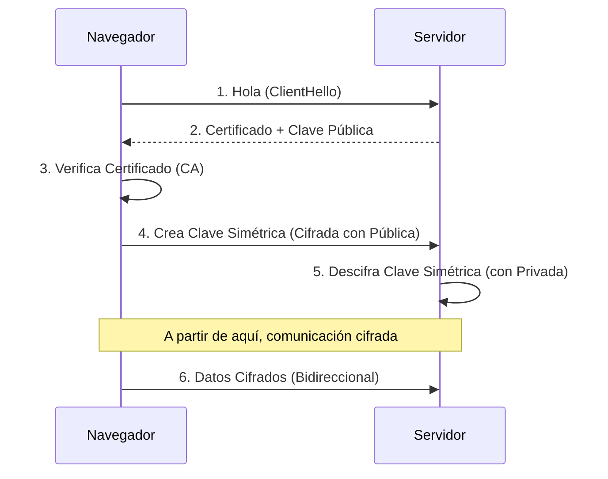

- [4. El Protocolo HTTP y HTTPS](#4-el-protocolo-http-y-https)
    - [4.1. Características y Ventajas del Protocolo HTTP](#41-características-y-ventajas-del-protocolo-http)
    - [4.2. Formato de Peticiones y Respuestas HTTP](#42-formato-de-peticiones-y-respuestas-http)
    - [4.3. Cabeceras HTTP](#43-cabeceras-http)
    - [4.4. Métodos/Verbos HTTP (GET, POST, PUT, DELETE, HEAD)](#44-métodosverbos-http-get-post-put-delete-head)
    - [4.5. Códigos de Estado HTTP](#45-códigos-de-estado-http)
    - [4.6. El Protocolo HTTPS (SSL/TLS y Certificados Digitales)](#46-el-protocolo-https-ssltls-y-certificados-digitales)

# 4. El Protocolo HTTP y HTTPS

## 4.1. Características y Ventajas del Protocolo HTTP

El **Protocolo HTTP (HyperText Transfer Protocol)** es la base de la comunicación en la World Wide Web. Es un protocolo **no orientado a la conexión**, lo que significa que cada petición entre cliente y servidor es independiente y no requiere mantener una conexión continua.

Sus principales **características** son:
*   **Sencillo**: Es en modo texto y fácil de usar directamente por una persona.
*   **Extensible**: Se pueden enviar más metadatos que los que están por defecto.
*   **Sin estado**: Cada petición es independiente. Esto es un problema para sitios como un carrito de la compra, pero se soluciona con *cookies* y sesiones.

HTTP es fundamental en arquitecturas distribuidas como los microservicios y es la base para la creación de APIs REST. Ofrece ventajas como la mejora de la velocidad al controlar la **caché** de las páginas, la **autenticación** de usuarios, el uso transparente de **proxies** y el mantenimiento del estado entre peticiones gracias a las **sesiones**. También permite indicar el formato de lo que se envía, pide y retorna.

💡 **Tip del Examinador**: "Sin estado" (Stateless) significa que el servidor no recuerda la petición anterior. Si necesitas que recuerde quién eres, debes enviar esa información (cookie, token) en *cada* petición nueva.

### 🧠 Analogía: Dory (Buscando a Nemo)

El servidor HTTP es como **Dory**: tiene memoria de pez a corto plazo. Si le pides algo, te lo da. Si le vuelves a pedir lo mismo 1 segundo después, no sabe quién eres ni que ya te lo dio.
Para que te recuerde, tienes que pegarte una nota en la frente (Cookie/Token) cada vez que hables con él.

## 4.2. Formato de Peticiones y Respuestas HTTP

La interacción en la web se basa en un intercambio constante de peticiones y respuestas HTTP entre el navegador del cliente y el servidor.
Una **petición HTTP** tiene una primera línea que incluye el método (ej. GET), la ruta del recurso solicitado (ej. `/index.html`), y la versión del protocolo (ej. `HTTP/1.1`), seguida de varias líneas con cabeceras que proporcionan metadatos.
La **respuesta HTTP** del servidor comienza con la versión del protocolo (ej. `HTTP/1.1`), seguida de un código de estado (ej. `200 OK`) y un texto que indica el resultado de la operación. Después de una línea vacía, se incluye el contenido del recurso solicitado (ej. HTML).

## 4.3. Cabeceras HTTP

Las cabeceras HTTP son mensajes adicionales que se envían tanto en las peticiones como en las respuestas para proporcionar información clave sobre la comunicación.
**Cabeceras de Petición Comunes**:
*   `Accept`: El formato MIME type en el que se quieren los datos (ej., `text/html`, `application/json`).
*   `Accept-Language`: El idioma preferido para la respuesta (ej., `fr`).
*   `Host`: El dominio al que se dirige la petición, muy útil para alojar varios dominios en un mismo servidor.
*   `Content-Type`: Describe el formato y la codificación de los datos que se envían en el cuerpo de la petición.
*   `Content-Length`: Tamaño en bytes de los datos que se envían.
*   `User-Agent`: Información sobre el navegador del cliente.

**Cabeceras de Respuesta Comunes**:
*   `Content-Type`: El formato y la codificación de los datos que se retornan (ej., `text/html; charset=utf-8`), crucial para que el navegador interprete correctamente el contenido.
*   `Content-Language`: El idioma de los datos que se retornan.
*   `Content-Length`: Tamaño en bytes de los datos que se retornan.
*   `Cache-Control`: Cuánto tiempo pueden estar cacheados los datos.
*   `Server`: Indica información del servidor (ej. Apache/2.2.3).

## 4.4. Métodos/Verbos HTTP (GET, POST, PUT, DELETE, HEAD)

Los métodos HTTP, también llamados verbos, definen la acción que un cliente desea realizar sobre un recurso en el servidor.
*   **GET**: Se utiliza para **obtener** o recuperar un recurso. Generalmente, no se envían datos en el cuerpo de la petición; cualquier parámetro se adjunta a la URL como una cadena de consulta (*query string*).
*   **POST**: Se usa para **añadir** un nuevo recurso o **enviar** datos al servidor. Los datos se incluyen en el cuerpo de la petición, después de las cabeceras, y no son visibles en la URL.
*   **PUT**: Se utiliza para **actualizar** o **reemplazar** completamente un recurso existente en el servidor con los datos proporcionados.
*   **DELETE**: Se usa para **borrar** un recurso o entidad específica del servidor.
*   **HEAD**: Solicita las mismas cabeceras de respuesta que un método GET, pero sin el cuerpo de la respuesta. Es útil para verificar la existencia de un recurso o sus metadatos sin descargar el contenido completo.

📝 **Nota del Profesor**: En APIs RESTful, usamos estos verbos semánticamente. `POST` es Crear, `GET` es Leer, `PUT` es Actualizar y `DELETE` es Borrar. Esto se conoce como **CRUD**.

## 4.5. Códigos de Estado HTTP

Después de cada petición, el servidor envía una respuesta que incluye un código de estado HTTP. Este código es un número de tres dígitos que indica el resultado y el estado de la petición.
*   **1XX (Informativas)**: La petición ha sido recibida y el proceso continúa.
*   **2XX (Éxito)**: La acción del cliente fue recibida, entendida y aceptada. Por ejemplo, **200 OK** indica que la petición se ha procesado correctamente.
*   **3XX (Redirección)**: El cliente necesita realizar una acción adicional para completar la petición (ej., el recurso se ha movido).
*   **4XX (Error del Cliente)**: La petición contiene un error o no puede ser completada debido a un problema en el lado del cliente (ej. **403 Forbidden**, **404 Not Found**).
*   **5XX (Error del Servidor)**: El servidor falló al completar una petición aparentemente válida.

💡 **Tip del Examinador**: Apréndete estos:
- **200**: Todo OK.
- **201**: Creado (típico tras un POST).
- **400**: Petición incorrecta (Bad Request).
- **401**: No autenticado (¿Quién eres?).
- **403**: Prohibido (Sé quién eres, pero no puedes pasar).
- **404**: No encontrado.
- **500**: Error interno del servidor (excepción no controlada).

### 🚦 Mnemotecnia Rápida de Códigos

*   **2xx**: ✅ **Bien**. (Aquí tienes).
*   **3xx**: ↪️ **Vete**. (Está en otro sitio).
*   **4xx**: 🤦 **Tú** la has liado. (Cliente se equivoca).
*   **5xx**: 💥 **Yo** la he liado. (Servidor explota).

## 4.6. El Protocolo HTTPS (SSL/TLS y Certificados Digitales)

**HTTPS** (HyperText Transfer Protocol Secure) es la versión segura del protocolo HTTP, esencial para la transferencia confidencial y segura de información entre el cliente y el servidor. A diferencia de HTTP, que transmite datos en texto claro y vulnerable a la intercepción, HTTPS **cifra** la información, asegurando su privacidad.

La seguridad en HTTPS se basa en el uso de **certificados digitales**. Estos documentos electrónicos vinculan una clave pública a la identidad de un propietario (servidor web). Son emitidos por **Autoridades de Certificación (AC)**, que son entidades de confianza que firman digitalmente los certificados para validar su autenticidad. Los navegadores web confían en estas AC y alertan al usuario si un certificado no es válido, está autofirmado o no coincide con el sitio, lo que puede generar advertencias de seguridad.

El proceso de cifrado utiliza el **cifrado de clave pública o asimétrico**. El navegador cifra la información con la clave pública del servidor, y solo el servidor, con su clave privada correspondiente, puede descifrarla, garantizando así la confidencialidad. Los protocolos **SSL/TLS** (Secure Sockets Layer/Transport Layer Security) son los estándares criptográficos que hacen posibles estas conexiones seguras, proporcionando autenticación y privacidad. El cifrado requiere recursos computacionales, lo que puede tener un impacto mínimo en el rendimiento del servidor web. HTTP y HTTPS pueden convivir en un mismo dominio.

