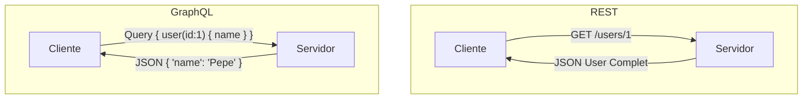
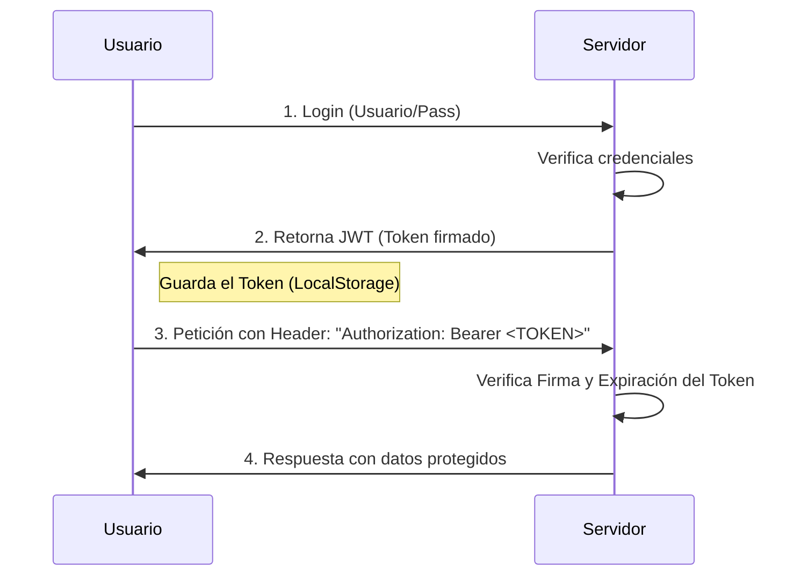

- [5. Servicio Web y Comunicación con APIs](#5-servicio-web-y-comunicación-con-apis)
    - [5.1. ¿Qué es un Servicio Web y Qué Aporta?](#51-qué-es-un-servicio-web-y-qué-aporta)
    - [5.2. Diferencia entre un Servicio Web y una Página Web Dinámica](#52-diferencia-entre-un-servicio-web-y-una-página-web-dinámica)
    - [5.3. Protocolos de Comunicación de API](#53-protocolos-de-comunicación-de-api)
        - [5.3.6. Otros Protocolos y Estilos de Comunicación (mención breve)](#536-otros-protocolos-y-estilos-de-comunicación-mención-breve)
    - [5.4. JWT (JSON Web Token) - Concepto de Autenticación y Autorización](#54-jwt-json-web-token---concepto-de-autenticación-y-autorización)
    - [5.5. Ejemplo de arquitectura Netflix](#55-ejemplo-de-arquitectura-netflix)

# 5. Servicio Web y Comunicación con APIs

## 5.1. ¿Qué es un Servicio Web y Qué Aporta?

Un **servicio web** (o Web Service) es una **API (Application Programming Interface)** que permite a otra aplicación comunicarse remotamente para acceder a un servicio. Son conjuntos de reglas y protocolos que permiten a diferentes aplicaciones o sistemas comunicarse y compartir datos a través de la web. Se basan en protocolos web estándar como HTTP y utilizan formatos de intercambio de datos como JSON o XML. Cada funcionalidad o servicio expuesto por una API se identifica a menudo mediante un *endpoint* (URL en el lado servidor).

Los servicios web son **fundamentales en el desarrollo de aplicaciones modernas**. Aportan:
*   **Integración**: Permiten que diferentes sistemas se conecten y compartan funcionalidades, como una aplicación de escritorio publicando en Twitter vía su API.
*   **Flexibilidad y Escalabilidad**: Facilitan la creación de aplicaciones más robustas y escalables al dividir funcionalidades en servicios independientes.
*   **Reutilización**: Un servicio puede ser consumido por múltiples clientes (web, móvil, escritorio).
*   **Agnosticismo**: El Back-end se vuelve agnóstico al cliente, entregando datos que cada cliente representa a su manera.

### 🤖 Analogía: La Máquina Expendedora

Una API es como una **máquina expendedora**.
*   No necesitas saber cómo funciona por dentro (engranajes, refrigeración).
*   Solo necesitas saber la **Interfaz**: Botones (Endpoints) y Monedas (Parámetros/Auth).
*   Si pulsas "A1" y metes 1€, sale un refresco (JSON). Siempre igual, fiable y sin interacción humana.

## 5.2. Diferencia entre un Servicio Web y una Página Web Dinámica

La distinción entre un servicio web y una página web dinámica radica en su propósito y la naturaleza de su interacción:
*   Una **página web dinámica** está diseñada para **generar contenido HTML (u otros formatos interpretables por un navegador)** que el usuario final visualiza en su navegador. Su objetivo principal es la presentación y la interacción directa con el usuario a través de una interfaz gráfica.
*   Un **servicio web (API)**, por el contrario, está diseñado para **exponer datos y funcionalidades** a *otras aplicaciones*, no directamente a usuarios finales a través de una interfaz gráfica. Aunque se accede vía HTTP, su respuesta no es una página HTML para el usuario, sino **datos estructurados** (JSON, XML) que otras aplicaciones consumen para luego mostrarlos o procesarlos. Es el "lenguaje" que hablan las máquinas entre sí.

En una arquitectura moderna, una página web dinámica (especialmente una SPA) puede consumir múltiples servicios web para construir su interfaz y obtener datos, mientras que los servicios web actúan como el *backbone* de datos para esta y otras aplicaciones.

## 5.3. Protocolos de Comunicación de API

La elección del protocolo de comunicación de API adecuado es una decisión arquitectónica crítica que impactará el rendimiento, la escalabilidad, la experiencia del usuario e incluso los costes del proyecto. Comprender las fortalezas y debilidades de los diferentes protocolos es esencial.

**Tabla Comparativa de Protocolos de Comunicación de API**

| Protocolo/Estilo | **Descripción**                                                                                                                                                      | **Formato Datos**           | **Comunicación**                                                                                                                                      | **Ventajas**                                                                                                                                                                                                                               | **Desventajas**                                                                                                                                                   | **Uso Ideal**                                                                                                                                                                           |
| :--------------- | :------------------------------------------------------------------------------------------------------------------------------------------------------------------- | :-------------------------- | :---------------------------------------------------------------------------------------------------------------------------------------------------- | :----------------------------------------------------------------------------------------------------------------------------------------------------------------------------------------------------------------------------------------- | :---------------------------------------------------------------------------------------------------------------------------------------------------------------- | :-------------------------------------------------------------------------------------------------------------------------------------------------------------------------------------- |
| **REST**         | Estilo arquitectónico basado en HTTP para operaciones CRUD. Los recursos se identifican mediante URLs.                                                               | JSON (principalmente), XML. | Peticiones HTTP estándar (GET, POST, PUT, DELETE).                                                                                                    | Sencillo y familiar, amplia compatibilidad, escalable, sin estado, fácil de almacenar en caché HTTP.                                                                                                                                       | Puede haber sobre-obtención (over-fetching) o sub-obtención (under-fetching) de datos.                                                                            | APIs públicas, operaciones CRUD, microservicios simples.                                                                                                                                |
| **GraphQL**      | Lenguaje de consulta. Permite a los clientes solicitar **exactamente los datos que necesitan**.                                                                      | JSON (para respuestas).     | Peticiones HTTP POST, con la consulta GraphQL en el cuerpo.                                                                                           | Recuperación muy eficiente de datos (evita sobre/sub-obtención), un solo endpoint.                                                                                                                                                         | Complejidad en el lado del servidor, dificultad para *caching* HTTP tradicional.                                                                                  | Aplicaciones complejas con interfaces de usuario exigentes (ej., Facebook), clientes móviles con ancho de banda limitado.                                                               |
| **gRPC**         | Marco de **Llamada a Procedimiento Remoto (RPC)** moderno y de alto rendimiento.                                                                                     | Protocol Buffers (binario). | Se basa en HTTP/2.                                                                                                                                    | Extremadamente rápido y eficiente (binario), bajo latencia, contratos fuertemente tipados.                                                                                                                                                 | Menos legible para humanos, requiere proxy para navegadores, curva de aprendizaje.                                                                                | Comunicación interna de microservicios, servicios de *streaming*, entornos donde el rendimiento es crítico.                                                                             |
| **WebSocket**    | Protocolo de comunicación **persistente, bidireccional y en tiempo real**.                                                                                           | JSON, Texto, Binario.       | Conexión persistente TCP.                                                                                                                             | Verdadero tiempo real, eficiente para mensajes frecuentes.                                                                                                                                                                                 | Conexión con estado (difícil de escalar horizontalmente), configuración compleja de proxy.                                                                        | Chats, notificaciones en tiempo real, juegos multijugador.                                                                                                                              |
| **SOAP**         | Protocolo basado en **XML** para intercambio estructurado.                                                                                                           | XML.                        | Peticiones HTTP POST con XML.                                                                                                                         | Altamente estandarizado (WS-Security), independiente del lenguaje.                                                                                                                                                                         | Verboso y pesado (XML), complejo de implementar.                                                                                                                  | Grandes empresas, banca, sistemas heredados (Legacy).                                                                                                                                   |

📝 **Nota del Profesor**: Hoy en día, **REST con JSON** es el estándar de facto para la mayoría de las aplicaciones web. **GraphQL** está ganando terreno cuando necesitas optimizar mucho los datos que viajan a la red (como en móviles).

### 🍔 Analogía: REST vs GraphQL

*   **REST (Menú del Día)**: Pides el "Menú 1". Te traen sopa, filete y postre. ¿Solo querías el filete? Te aguantas, te traen todo (Over-fetching). ¿Querías filete y café? Tienes que pedir el "Menú 1" y luego llamar al camarero otra vez para el café (Múltiples peticiones).
*   **GraphQL (Buffet Libre)**: Tienes una lista gigante de todo lo que hay. Tú dices: "Quiero solo un trozo de filete y medio café". Y te traen *exactamente* eso en un solo plato. Eficiente y a medida.

### 5.3.6. Otros Protocolos y Estilos de Comunicación (mención breve)

Existen otros protocolos y estilos de comunicación que se adaptan a necesidades específicas:
*   **Webhook**: Mecanismo de *callback* HTTP que permite a un servicio enviar notificaciones en tiempo real a una URL preconfigurada cuando ocurre un evento específico.
*   **MQTT**: Protocolo ligero de publicación-subscripción diseñado para IoT.
*   **Server-Sent Events (SSE)**: Estándar que permite a un servidor enviar actualizaciones unidireccionales de texto a un cliente.
*   **Apache Kafka**: Plataforma distribuida de *streaming* de eventos para grandes volúmenes de datos.

## 5.4. JWT (JSON Web Token) - Concepto de Autenticación y Autorización

Un **JSON Web Token (JWT)** es un estándar abierto para crear tokens de acceso que permiten intercambiar información de forma segura entre dos partes como un objeto JSON firmado digitalmente. Son ampliamente utilizados para la autenticación y autorización en APIs web modernas.

Un JWT consta de tres partes separadas por puntos:
1.  **Header (Encabezado):** Tipo de token y algoritmo de firma (HS256).
2.  **Payload (Carga Útil):** Datos del usuario (*claims*), como ID, rol, expiración.
3.  **Signature (Firma):** Garantiza que el token no ha sido modificado.

La estructura final de un JWT es una cadena compacta que representa estas tres partes codificadas. Se utilizan para que el servidor pueda verificar la identidad de un usuario en peticiones posteriores sin tener que consultar repetidamente una base de datos de sesiones, mejorando la eficiencia y la escalabilidad.

⚠️ **Advertencia**: ¡Nunca guardes información sensible (como contraseñas) dentro del Payload del JWT! El Payload solo está codificado en Base64, cualquiera puede leerlo. Lo que no pueden es *modificarlo* sin invalidar la firma.

## 5.5. Ejemplo de arquitectura Netflix

Netflix utiliza una arquitectura orientada a **microservicios** que les permite separar su plataforma en servicios pequeños e independientes. Esto mejora la escalabilidad, la disponibilidad y la fiabilidad de la plataforma. 

* **Microservicios**: Cada función, como la autenticación de usuarios, la gestión de perfiles o las recomendaciones de contenido, se ejecuta como un servicio individual. Esto permite que los equipos de desarrollo trabajen y desplieguen servicios de forma independiente.
* **Basado en la nube**: Netflix migró completamente a **Amazon Web Services (AWS)**, lo que le permite escalar recursos de forma dinámica según la demanda.
* **Open Connect**: Es su propia red de distribución de contenido (CDN) global. Este sistema almacena copias del contenido de Netflix en servidores locales de los proveedores de servicios de internet (ISP) para acercar el contenido a los usuarios, reduciendo la latencia y la carga en la red.

**Tecnologías Front-end**
* **JavaScript y React**: El sitio web y las aplicaciones para Smart TVs utilizan JavaScript, en su mayoría con la biblioteca **React**, para construir componentes y páginas de manera eficiente.

**Tecnologías Back-end**
* **Java**: Es el lenguaje principal para la mayoría de los microservicios.
* **Python**: Se utiliza para tareas específicas, como el análisis de datos.
* **Bases de datos**: Cassandra (NoSQL) para gran volumen y MySQL para transacciones críticas.
* **APIs**: La comunicación entre los servicios y el front-end se realiza a través de APIs.

