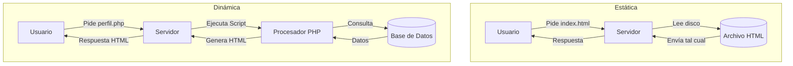

- [6. Funcionamiento de una Web Dinámica y Generación de Contenido](#6-funcionamiento-de-una-web-dinámica-y-generación-de-contenido)
    - [6.1. Páginas estáticas vs. Páginas dinámicas](#61-páginas-estáticas-vs-páginas-dinámicas)
    - [6.2. Cómo Funciona una Página Web Dinámica](#62-cómo-funciona-una-página-web-dinámica)
    - [6.3. Tecnologías de Generación de Páginas Web Dinámicas y Ejemplos "Hola Mundo"](#63-tecnologías-de-generación-de-páginas-web-dinámicas-y-ejemplos-hola-mundo)

# 6. Funcionamiento de una Web Dinámica y Generación de Contenido

## 6.1. Páginas estáticas vs. Páginas dinámicas
La principal diferencia entre una página web estática y una dinámica radica en cómo y cuándo se genera el contenido. Una página estática es como un documento fijo que siempre muestra el mismo contenido, mientras que una dinámica se construye en tiempo real para cada visitante, adaptándose a sus necesidades o interacciones.

**Páginas Web Estáticas** 

Son páginas que están compuestas por archivos predefinidos (HTML, CSS, JavaScript) que se almacenan directamente en el servidor. Cuando un usuario solicita la página, el servidor simplemente envía esos archivos tal como están, sin ningún procesamiento adicional.

* **Contenido fijo**: El contenido es el mismo para todos los usuarios.
* **Velocidad**: Son muy rápidas de cargar.
* **Tecnologías**: HTML, CSS, JS.
* **Uso común**: Landing pages, portafolios, documentación.

**Páginas Web Dinámicas**

Son páginas que se generan en el momento en que un usuario las solicita. El servidor procesa la petición, ejecuta código del lado del servidor, se conecta a una base de datos para obtener información y luego genera el HTML final que se envía al navegador del usuario.

* **Contenido variable**: Cambia según el usuario, hora, etc.
* **Interactividad**: Login, carritos, comentarios.
* **Tecnologías**: PHP, Python, Java, Node.js + BBDD.
* **Uso común**: Redes sociales, tiendas online, aplicaciones de gestión.



### 📰 Analogía: El Periódico vs Twitter

*   **Página Estática (Periódico de Papel)**: Se imprime por la mañana. Si compras uno a las 9:00 y otro a las 18:00, dice exactamente lo mismo. Todos los lectores ven las mismas noticias. Si hay una noticia de última hora, no sale hasta la edición de mañana.
*   **Página Dinámica (Twitter/X)**: Se genera al momento. Si entras a las 9:00 ves unas cosas, y a las 18:00 ves otras. Además, tu *timeline* es diferente al de tu amigo. Se construye "a medida" para ti en ese instante.

## 6.2. Cómo Funciona una Página Web Dinámica

Las páginas web dinámicas se caracterizan por su contenido variable, que se genera "sobre la marcha" en el servidor en función de diversas condiciones.

El proceso de funcionamiento es el siguiente:
1.  **El cliente web (navegador) solicita una página web al servidor web**.
2.  **El servidor web recibe la petición HTTP**. Si se trata de una página estática, el servidor simplemente la envía. Si es dinámica, el servidor no tiene la página almacenada en su forma final.
3.  **El servidor web contacta con el módulo responsable de ejecutar el código dinámico** y le envía la petición. Este módulo puede ser interno (ej. `mod_php` en Apache) o un servidor de aplicaciones externo (ej. Tomcat para Java).
4.  **El módulo de ejecución procesa el código (script)**. Como parte de este proceso, puede ser necesario obtener información de un repositorio, como una base de datos.
5.  **El resultado de esta ejecución es una página en formato HTML**, que es el contenido que se devolverá al navegador.
6.  **El servidor web envía esta página HTML resultante al navegador**, que la procesa y la muestra en pantalla.


💡 **Tip del Examinador**: Este proceso se conoce como **SSR (Server Side Rendering)**. El servidor "cocina" el HTML y se lo da "comido" al navegador. Es diferente a las SPAs modernas donde el navegador recibe datos JSON y "cocina" (renderiza) el HTML en el cliente.

## 6.3. Tecnologías de Generación de Páginas Web Dinámicas y Ejemplos "Hola Mundo"

Las principales tecnologías para generar páginas web dinámicas utilizan la integración de lenguajes de programación del lado del servidor con lenguajes de marcado como HTML.

**Tabla Comparativa (Resumida)**

| Tecnología | Lenguaje | Características |
| :--- | :--- | :--- |
| **PHP / Laravel** | PHP | Fácil aprendizaje, rey del hosting barato. |
| **Java / Spring** | Java | Robusto, empresarial, tipado estático. |
| **ASP.NET Core** | C# | Alto rendimiento, ecosistema Microsoft. |
| **Django / Flask** | Python | Sintaxis limpia, potente en datos/IA. |
| **Node.js** | JS | Mismo lenguaje en cliente y servidor, asíncrono. |

**Ejemplos de "Hola Mundo":**

*   **PHP (con código embebido en HTML)**:
    ```php
    <!DOCTYPE html>
    <html>
    <body>
        <?php
            // El código PHP se ejecuta en el servidor.
            echo "<h1>Hola Mundo desde PHP</h1>";
            $nombre = "Alumno";
            echo "<p>Bienvenido, " . $nombre . "!</p>";
        ?>
    </body>
    </html>
    ```

*   **Java con JSP (JavaServer Pages)**:
    ```jsp
    <!DOCTYPE html>
    <html>
    <body>
        <h1>Hola, Mundo desde JSP</h1>
        <%
            String nombre = "Usuario";
            out.println("<p>Hola " + nombre + "</p>");
        %>
    </body>
    </html>
    ```

*   **Java con Spring Boot (Controlador)**:
    ```java
    @RestController
    public class HelloController {
        @GetMapping("/hello")
        public String hello() {
            return "<h1>Hola Mundo desde Spring Boot</h1>";
        }
    }
    ```

*   **Python con Django (Template)**:
    ```html
    <h1>Hola, Mundo desde Django</h1>
    
        <p>¡Hola, {{ nombre }}!</p>
    
    ```

📝 **Nota del Profesor**: Fíjate cómo en PHP y JSP mezclamos código lógico con HTML. Esto se llama "código espagueti" si no se controla bien. Los frameworks modernos (Spring, Laravel, Django) separan esto usando el patrón MVC.