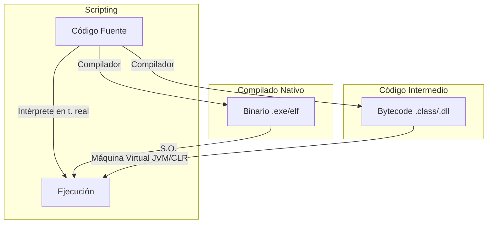

- [7. Lenguajes y Frameworks de Programación en Entorno Servidor](#7-lenguajes-y-frameworks-de-programación-en-entorno-servidor)
    - [7.1. Tipos de Ejecución de Lenguajes del Lado del Servidor](#71-tipos-de-ejecución-de-lenguajes-del-lado-del-servidor)
    - [7.2. Plataformas Web Libres y Propietarias](#72-plataformas-web-libres-y-propietarias)
    - [7.3. Tecnologías para el Desarrollo de Servicios](#73-tecnologías-para-el-desarrollo-de-servicios)
    - [7.4. Integración del Código con Lenguajes de Marcas](#74-integración-del-código-con-lenguajes-de-marcas)

# 7. Lenguajes y Frameworks de Programación en Entorno Servidor

## 7.1. Tipos de Ejecución de Lenguajes del Lado del Servidor

Los lenguajes de programación utilizados en el lado del servidor se ejecutan de diferentes maneras. Debemos distinguir tres grandes grupos:
*   **Lenguajes de Guiones (Scripting)**: Los programas se ejecutan directamente a partir de su código fuente. Un intérprete procesa el código línea por línea.
    *   *Ejemplos*: PHP, Python, JavaScript (Node.js).
    *   *Ventaja*: Desarrollo rápido, no requieren compilación previa.
*   **Lenguajes Compilados a Código Nativo**: El código fuente se traduce completamente a código máquina antes de la ejecución.
    *   *Ejemplos*: C++, Go, Rust.
    *   *Ventaja*: Máximo rendimiento.
*   **Lenguajes Compilados a Código Intermedio (Bytecode)**: El código fuente se compila a un formato intermedio que luego es ejecutado por una máquina virtual.
    *   *Ejemplos*: Java (JVM), C# (.NET CLR).
    *   *Ventaja*: Equilibrio entre rendimiento y portabilidad ("Write Once, Run Anywhere").

### 🗣️ Analogía: Interpretado vs Compilado

*   **Interpretado (PHP/Python)**: Es como un **Traductor Simultáneo**. Tú hablas (código) y él traduce frase a frase al momento. Si te equivocas en la última frase, se da cuenta al final. Es flexible pero más lento.
*   **Compilado (C++/Go)**: Es como **Traducir un Libro entero e imprimirlo**. Tarda mucho al principio (compilación), pero una vez tienes el libro en el idioma final (código máquina), lo puedes leer rapidísimo sin traductores en medio. Si hay un error, no se imprime hasta que lo corrijas.

## 7.2. Plataformas Web Libres y Propietarias

Una plataforma web es el entorno de desarrollo de software empleado para diseñar y ejecutar un sitio web. Generalmente, se compone de: **S.O. + Servidor Web + Base de Datos + Lenguaje**.

Algunas combinaciones populares (Stacks):
*   **LAMP**: **L**inux, **A**pache, **M**ySQL, **P**HP/Python/Perl. (El clásico Open Source).
*   **MEAN/MERN**: **M**ongoDB, **E**xpress, **A**ngular/**R**eact, **N**ode.js. (Full JavaScript).
*   **WISA**: **W**indows, **I**IS, **S**QL Server, **A**SP.NET. (Microsoft).
*   **WAMP / XAMPP**: Versiones para Windows de LAMP, muy usadas para aprender en local.

💡 **Tip del Examinador**: En este ciclo formativo nos centraremos mucho en entornos basados en **Linux** y **Java/PHP**, ya que son estándares industriales abiertos.

## 7.3. Tecnologías para el Desarrollo de Servicios

El desarrollo de servicios se centra en la creación de APIs para que las aplicaciones se comuniquen.

**Tabla Comparativa (Resumen)**

| Tecnología | Uso Principal | Frameworks |
| :--- | :--- | :--- |
| **Java** | Enterprise, Microservicios | **Spring Boot**, Quarkus, Jakarta EE |
| **C#** | Enterprise, Cloud Azure | **ASP.NET Core** |
| **PHP** | Webs Rápidas, CMS | **Laravel**, Symfony |
| **JavaScript** | I/O intensivo, Realtime | **Express**, NestJS |
| **Python** | Data Science, IA, Backend | **Django**, FastAPI |

## 7.4. Integración del Código con Lenguajes de Marcas

Una técnica fundamental para crear páginas web dinámicas es integrar código de programación directamente dentro de lenguajes de marcado como HTML.

*   En el modelo **MVC (Modelo-Vista-Controlador)** lado servidor (Server-Side MVC): El lenguaje (PHP, JSP) se incrusta en el HTML. El servidor procesa y escupe HTML limpio.
*   En aplicaciones **SPA (Client-Side Rendering)**: El HTML es mínimo. JavaScript en el navegador pide datos (JSON) y construye el HTML dinámicamente usando el DOM.

📝 **Nota del Profesor**: Aunque empezamos viendo código incrustado (como PHP dentro de HTML), la tendencia profesional es separar completamente el Backend (API JSON) del Frontend (HTML/JS generado por React/Angular).