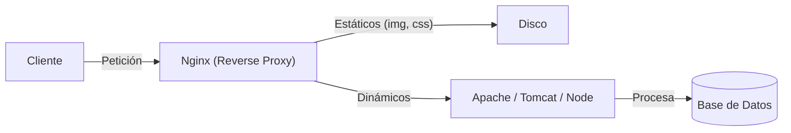

- [8. Funcionamiento y Configuración de Servidores Web y de Aplicaciones](#8-funcionamiento-y-configuración-de-servidores-web-y-de-aplicaciones)
    - [8.1. Servidores Web: Apache y Nginx](#81-servidores-web-apache-y-nginx)
        - [8.1.1. Instalación y Configuración Básica de Apache (Linux)](#811-instalación-y-configuración-básica-de-apache-linux)
        - [8.1.2. Arranque y Detención](#812-arranque-y-detención)
        - [8.1.3. Configuración de Hosts Virtuales (VirtualHosts)](#813-configuración-de-hosts-virtuales-virtualhosts)
    - [8.2. Servidores de Aplicaciones: Tomcat](#82-servidores-de-aplicaciones-tomcat)
        - [8.2.1. Instalación y Configuración Básica](#821-instalación-y-configuración-básica)
    - [8.3. Gestores de Bases de Datos](#83-gestores-de-bases-de-datos)

# 8. Funcionamiento y Configuración de Servidores Web y de Aplicaciones

## 8.1. Servidores Web: Apache y Nginx

Un **servidor web** es el "portero" de nuestra aplicación. Escucha en el puerto 80 (HTTP) o 443 (HTTPS) y sirve ficheros estáticos (imágenes, CSS, HTML) o pasa la petición a un intérprete (PHP, Java) si es contenido dinámico.

**Apache HTTP Server**
*   El veterano. Código abierto.
*   **Modular**: Se activa/desactiva funcionalidad con módulos (`a2enmod`).
*   Configuración mediante ficheros `.htaccess` (muy flexible, pero penaliza rendimiento).
*   Modelo de procesos: Crea hilos/procesos por conexión.

**Nginx**
*   El moderno (aunque ya tiene años).
*   **Rendimiento**: Arquitectura orientada a eventos (asíncrona). Aguanta mucha más carga concurrente con menos RAM.
*   Muy usado como **Proxy Inverso** y balanceador de carga.
*   Configuración centralizada (no usa `.htaccess`).



### 8.1.1. Instalación y Configuración Básica de Apache (Linux)

*   **Instalación**: `sudo apt install apache2`
*   **Directorio Web**: `/var/www/html/` (Aquí pones tus ficheros).
*   **Ficheros Config**: `/etc/apache2/`
    *   `apache2.conf`: Configuración global.
    *   `sites-available/`: Donde defines tus VirtualHosts.

### 8.1.2. Arranque y Detención
*   `sudo service apache2 start`
*   `sudo service apache2 stop`
*   `sudo service apache2 restart`
*   `sudo systemctl status apache2` (Para ver si ha fallado algo).

### 8.1.3. Configuración de Hosts Virtuales (VirtualHosts)
Permiten tener **varias webs en un mismo servidor** (misma IP). El servidor sabe cuál servir mirando la cabecera `Host` de la petición HTTP.

```apache
<VirtualHost *:80>
    ServerName www.miweb.com
    DocumentRoot /var/www/miweb
    ErrorLog ${APACHE_LOG_DIR}/error.log
</VirtualHost>
```

💡 **Tip del Examinador**: Recuerda que para que un VirtualHost funcione, no basta con crear el fichero. Debes habilitarlo con `sudo a2ensite miweb.conf` y recargar Apache.

## 8.2. Servidores de Aplicaciones: Tomcat

Un **servidor de aplicaciones** va más allá de servir HTML. Proporciona un entorno completo para ejecutar lógica de negocio compleja, transacciones, colas de mensajes, etc.

**Apache Tomcat**
*   Es el contenedor de **Servlets y JSP** por excelencia.
*   Implementación de referencia de Java EE (ahora Jakarta EE) para la parte web.
*   Escucha por defecto en el puerto **8080**.

### 8.2.1. Instalación y Configuración Básica
Requiere tener instalado el **JDK (Java Development Kit)**.
*   `sudo apt install tomcat9`
*   Gestión: `sudo service tomcat9 start`
*   Las aplicaciones se despliegan copiando el fichero `.war` en la carpeta `webapps`.

📝 **Nota del Profesor**: En la vida real (producción), no solemos exponer Tomcat directamente a Internet (puerto 8080). Ponemos un Nginx o Apache delante (puerto 80/443) haciendo de "proxy" por seguridad y rendimiento.

### 🛎️ Analogía: El Recepcionista vs La Cocina

*   **Servidor Web (Apache/Nginx)**: Es el **Recepcionista**. Te saluda, te da la carta (HTML estático), te sirve las bebidas (imágenes). Si pides algo complicado, se lo pasa a la cocina.
*   **Servidor de Aplicaciones (Tomcat/PHP)**: Es la **Cocina**. Allí se procesan los ingredientes, se cocina el plato (ejecuta el código) y se lo da al recepcionista para que te lo lleve a la mesa.

## 8.3. Gestores de Bases de Datos

Donde persisten los datos.
*   **MySQL / MariaDB**: Relacional (SQL). Estándar, rápido, Open Source.
*   **PostgreSQL**: Relacional (SQL). Más potente y estricto que MySQL. "El Oracle Open Source".
*   **MongoDB**: NoSQL (Documentos JSON). Flexible, escalable.
*   **Redis**: NoSQL (Clave-Valor). En memoria. Usado para caché y sesiones.

⚠️ **Advertencia**: Nunca expongas el puerto de la base de datos (ej. 3306) directamente a Internet. Solo debe ser accesible desde tu servidor web/aplicaciones (localhost o red privada).