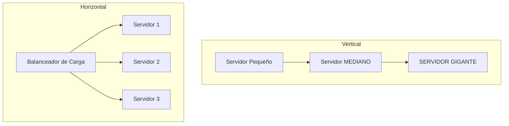
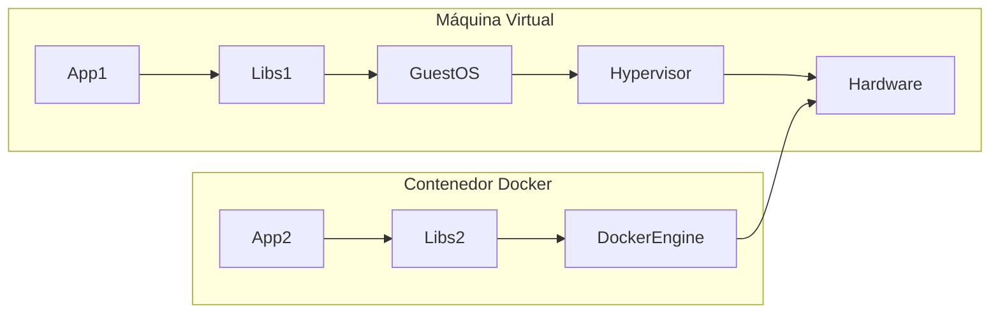
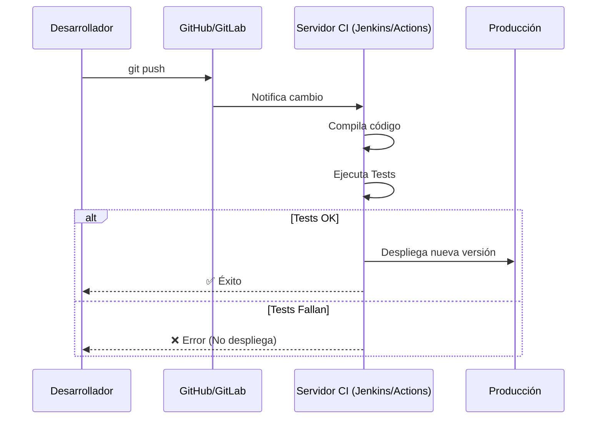

- [9. Despliegue de Aplicaciones Web](#9-despliegue-de-aplicaciones-web)
    - [9.1. Concepto de Despliegue](#91-concepto-de-despliegue)
    - [9.2. Escalabilidad (Vertical y Horizontal, Clusters y Balanceadores de Carga)](#92-escalabilidad-vertical-y-horizontal-clusters-y-balanceadores-de-carga)
    - [9.3. Despliegue en Contenedores (Docker, Kubernetes)](#93-despliegue-en-contenedores-docker-kubernetes)
    - [9.4. Despliegue en la Nube (AWS, Google Cloud, Azure)](#94-despliegue-en-la-nube-aws-google-cloud-azure)
    - [9.6. Introducción a la Integración Continua / Despliegue Continuo (CI/CD)](#96-introducción-a-la-integración-continua--despliegue-continuo-cicd)

# 9. Despliegue de Aplicaciones Web

## 9.1. Concepto de Despliegue

Para desplegar una aplicación web, se necesitan varios elementos: **Software** (S.O., servidores, runtimes), **Hardware** (CPU, RAM) y **Dependencias** (Librerías).
El despliegue es el proceso de llevar tu código desde tu ordenador ("localhost") hasta un servidor accesible por los usuarios ("producción").

## 9.2. Escalabilidad (Vertical y Horizontal, Clusters y Balanceadores de Carga)

La **escalabilidad** es la capacidad de crecer.

*   **Escalabilidad Vertical ("Scale Up")**: "Ponerle más RAM y mejor CPU a la máquina".
    *   *Limitación*: Llega un punto que es carísimo o físicamente imposible.
*   **Escalabilidad Horizontal ("Scale Out")**: "Poner más máquinas".
    *   *Ventaja*: Infinito teóricamente.
    *   *Necesidad*: Requiere un **Balanceador de Carga** para repartir el tráfico.

*   **Clusters**: Grupo de servidores trabajando juntos.
*   **Balanceadores de Carga (Load Balancer)**: El "semáforo" que dice: "Tú ve al servidor 1, tú al servidor 2".

### 🐄 Analogía: Mascotas vs Ganado (Pets vs Cattle)

*   **Servidores Clásicos (Mascotas)**: Les pones nombre (ej. "Zeus"), los cuidas mucho. Si "Zeus" enferma, llamas al veterinario (sysadmin) y pasas la noche en vela para arreglarlo.
*   **Contenedores/Nube (Ganado)**: Tienes el número 1045. Si enferma, no lo curas. Lo eliminas y creas uno nuevo idéntico en 1 segundo. No hay apego emocional, solo eficiencia.

## 9.3. Despliegue en Contenedores (Docker, Kubernetes)

El estándar actual.
*   **Docker**: Empaqueta tu aplicación con TODAS sus dependencias (librerías, versión de Java/PHP, etc.) en una caja cerrada llamada "Contenedor".
    *   *Ventaja*: Se acabó el "En mi máquina funcionaba". Si funciona en tu Docker, funciona en el servidor.
    *   *Ligero*: Comparte el núcleo del S.O., no es una Máquina Virtual completa.
*   **Docker Compose**: Orquestación sencilla (ej. "Levántame un contenedor con mi App y otro con la Base de Datos y conéctalos").
*   **Kubernetes (K8s)**: Orquestación masiva. Gestiona miles de contenedores, autoescalado, recuperación de fallos, etc.

![Diagrama de un entorno Docker Compose con servicios Apache/Nginx y PHP]

> **Nota**: ¡Fíjate que Docker no tiene GuestOS! Por eso es mucho más ligero y arranca en milisegundos.

## 9.4. Despliegue en la Nube (AWS, Google Cloud, Azure)

Ya no compramos servidores físicos ("On-premise"), los alquilamos por segundos.
*   **IaaS (Infrastructure as a Service)**: Alquilas máquinas virtuales (EC2). Tú instalas todo.
*   **PaaS (Platform as a Service)**: Subes tu código y ellos ponen el servidor (Heroku, App Engine).
*   **SaaS (Software as a Service)**: Usas el software final (Gmail, Drive).

## 9.6. Introducción a la Integración Continua / Despliegue Continuo (CI/CD)

Automatizar todo el proceso.
*   **CI (Continuous Integration)**: "Cada vez que guardo código (git push), se ejecutan los tests automáticamente". Si falla, me avisa.
*   **CD (Continuous Delivery/Deployment)**: "Si los tests pasan, despliégalo automáticamente en el servidor".

💡 **Tip del Examinador**: Entiende la diferencia: **Docker** crea el paquete (contenedor). **Kubernetes** gestiona esos paquetes. **CI/CD** automatiza la creación y envío de esos paquetes.