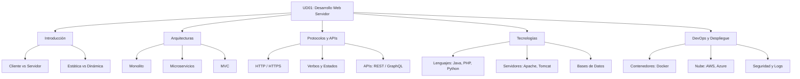

- [11. Resumen](#11-resumen)
  - [11.1. Resumen Global](#111-resumen-global)
  - [11.2. Mapa Mental de la Unidad](#112-mapa-mental-de-la-unidad)
  - [11.3. Checklist de Evaluación](#113-checklist-de-evaluación)
    - [🚀 ¡Ánimo con el estudio!](#-ánimo-con-el-estudio)
  - [Autor](#autor)
    - [Contacto](#contacto)
  - [Licencia de uso](#licencia-de-uso)

# 11. Resumen

## 11.1. Resumen Global

En esta unidad hemos sentado las bases de cómo funciona la **Web**. Hemos visto que ya no son simples documentos estáticos, sino complejas **Aplicaciones Web** distribuidas.

Hemos aprendido que:
1.  **Arquitectura Cliente-Servidor**: Es la base de todo. El navegador pide (Request), el servidor responde (Response).
2.  **HTTP/HTTPS**: Es el idioma que hablan. Verbos (GET, POST) y Códigos de Estado (200, 404, 500).
3.  **Frontend vs Backend**: Lo que ve el usuario (HTML/JS) vs la lógica y datos (PHP/Java/BBDD).
4.  **Web Dinámica**: El servidor genera el HTML al vuelo consultando Bases de Datos.
5.  **Despliegue y DevOps**: Docker y la Nube han cambiado cómo publicamos las webs, facilitando la escalabilidad y el mantenimiento.

## 11.2. Mapa Mental de la Unidad

Este diagrama resume el flujo completo de una petición web moderna tal como lo hemos estudiado:

```mermaid
graph TD
    UD01[UD01: Desarrollo Web Servidor] --> INT[Introducción]
    UD01 --> ARQ[Arquitecturas]
    UD01 --> PRO[Protocolos y APIs]
    UD01 --> TEC[Tecnologías]
    UD01 --> OPS[DevOps y Despliegue]

    INT --> CLI[Cliente vs Servidor]
    INT --> WEB[Estática vs Dinámica]

    ARQ --> MON[Monolito]
    ARQ --> MIC[Microservicios]
    ARQ --> MVC[MVC]

    PRO --> HTT[HTTP / HTTPS]
    PRO --> VER[Verbos y Estados]
    PRO --> API[APIs: REST / GraphQL]

    TEC --> LEN[Lenguajes: Java, PHP, Python]
    TEC --> SER[Servidores: Apache, Tomcat]
    TEC --> BBD[Bases de Datos]

    OPS --> DOC[Contenedores: Docker]
    OPS --> CLO[Nube: AWS, Azure]
    OPS --> SEG[Seguridad y Logs]
```

## 11.3. Checklist de Evaluación

Utiliza esta lista para verificar que dominas los conceptos clave antes del examen:

- [ ] **Diferencia Cliente vs Servidor**: Sé quién hace qué.
- [ ] **Estática vs Dinámica**: Entiendo por qué una requiere BBDD y procesamiento y la otra no.
- [ ] **HTTP**:
    - [ ] Conozco los verbos principales (GET, POST, PUT, DELETE).
    - [ ] Entiendo los códigos de estado (2xx, 3xx, 4xx, 5xx).
    - [ ] Sé qué es una Cabecera (Header).
- [ ] **Frontend vs Backend**: Distingo lenguajes (HTML/CSS/JS vs PHP/Java/Python).
- [ ] **Arquitecturas**:
    - [ ] Entiendo el concepto de Monolito.
    - [ ] Entiendo el concepto de Microservicios.
    - [ ] Sé qué es el patrón MVC.
- [ ] **Servidores**:
    - [ ] Diferencia entre Servidor Web (Apache/Nginx) y de Aplicaciones (Tomcat).
    - [ ] Concepto de VirtualHost.
- [ ] **Despliegue**:
    - [ ] Entiendo qué problema soluciona Docker ("funciona en mi máquina").
    - [ ] Sé qué es la Escalabilidad Horizontal y Vertical.

### 🚀 ¡Ánimo con el estudio!
La Web es gigante, pero ya conoces sus cimientos. Si entiendes cómo viaja una petición HTTP desde tu clic hasta la base de datos y vuelve, ¡ya tienes medio camino recorrido!

---

## Autor

Codificado con :sparkling_heart: por [José Luis González Sánchez](https://twitter.com/JoseLuisGS_)

### Contacto

  Cualquier cosa que necesites házmelo saber por si puedo ayudarte 💬.

## Licencia de uso

Este repositorio y todo su contenido está licenciado bajo licencia **Creative Commons**.

 
